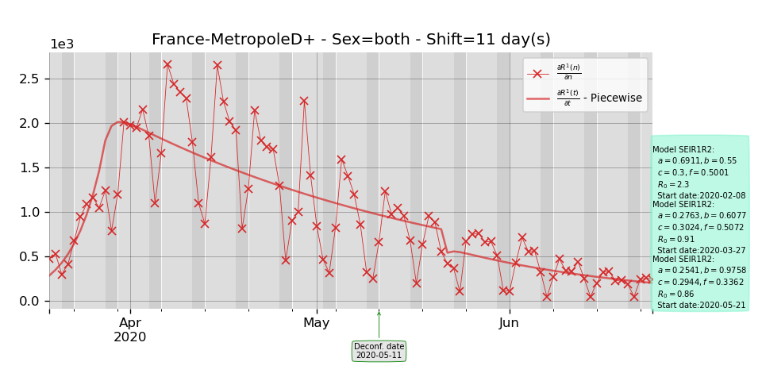

# Projet divoc

The directory **RedoFigInPreprint** shows a collection of Python3 scripts to process Covid data collected on the web (especially French data from *Sante Publique France*). 

Here is a result of using the script *Fit.py* when France is selected for input data.

The directory **RedoFigInPreprint** shows how to re-generate the figures in the preprint associated to this work.

## Contact

*stephane dot derrode at ec-lyon dot fr*
