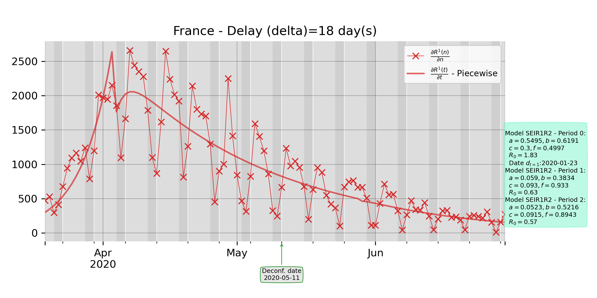

# Projet divoc

This repository contains a collection of Python3 scripts to process Covid data collected on the web (especially French data from *Sante Publique France*). The algorithms have been heavily tested for France, and for French regions and departments, but should also works for countries around the world (Italy, Israel...).

Here is a result of using the script *Fit.py* when France is selected for input data. Explanations of parameters can be read in the python script.

The directory **RedoFiguresInPreprint** shows how to re-generate by yourself the figures in the preprint associated to this work (you will also find there the latest version of the preprint).

## Contact

*stephane dot derrode at ec-lyon dot fr*
