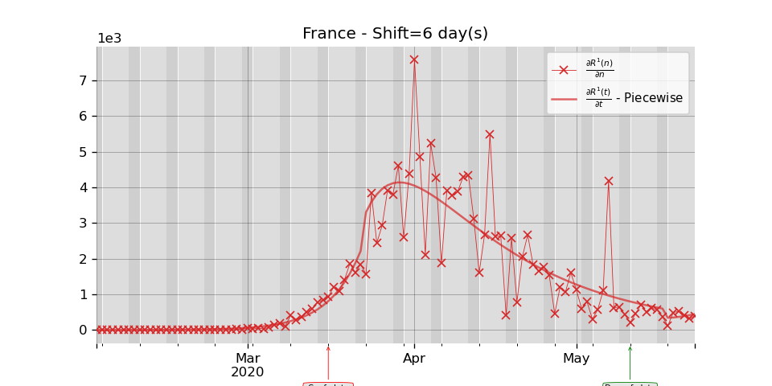
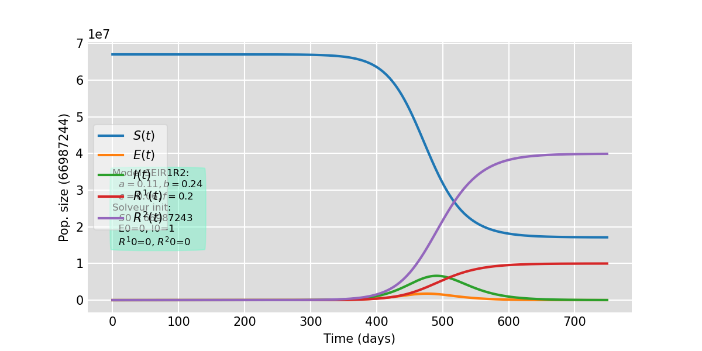

# Projet divoc

Collection of some  Python3 scripts (and some Jupyter Notebooks) to process Covid Data collected on the web. 

<!--The programs are based on the Kalman-like filters implemented by Roger R Labbe Jr. in the [FilterPy](https://filterpy.readthedocs.io/en/latest/index.html) python module. -->

Here is a result of using the script _Fit.py_ when France is selected (see text below).

## NonLinFiltering repository

### Presentations of python files

- The files _common.py_, _Covid_SpecialDates.py_ are for internal use:
   
    + *common.py*: Collection of functions for reading data on the web (or in data repository), for plotting, and many others.
    + *Covid_SpecialDates*: Class to set-up and manage special Covid dates for a country (confinement date(s), deconfinement date(s), others dates).

- The file _SEIR_Bacaer.py_ is the implementation of the pandemic model by N. Bacaert (see file for exact referencing). It is use in connection with _SolveEDO_SEIR1R2.py_.
      
- The file _SolveEDO_SEIR1R2.py_ contains a class used by programs to solve the EDO SIER1R2, but it is also runnable to simulate a SEIR1R2 model (see usage below).

- The files _PlotDataCovid.py_, _ProcessSEIR1R2.py_, _Fit.py_ and _TS_adjust.py_ are runnable scripts (see usage below).

### Usages

1. The first script to test is the _PlotDataCovid.py_ one, which generates plots of cases and deaths for whatever country, or for whatever department of France. Typical usages are:

	> python3 PlotDataCovid.py Germany

	> python3 PlotDataCovid.py France,Spain,Italy,United_Kingdom,Germany,Belgium
	
    > python3 PlotDataCovid.py France,69,75

See what kind of plots is generated in the _figures_ repository.

2. Then you will be interested in running the main program in _SolveEDO_SEIR1R2.py_ by

    > python3 SolveEDO_SEIR1R2.py

Modify the parameters in the main program (at the end of the file) to get different simulations. Here is an example of the plot generated (see _figures_ repo):

3. The next step is to run the script _ProcessSEIR1R2.py_. This is the main script, with (nearly) all the parameters editable by command argument:

    > python3 ProcessSEIR1R2.py France,69 1 0 0 1 1
    
    > python3 ProcessSEIR1R2.py Italy,Spain 2 10 0 1 1

First: the program deals with the French department 69, and try to find the parameters that best fit all the data (only one period). 
    
Second: You can also deals with 2 periods, where the separation is 10 days after the lock-down date of the considered countries.

4. Eventually, you can run these scripts for processing several countries or French counties at one

    > python3 Fit.py

The main goal of this program is to call the previous program with its two configurations (one period or two periods of estimation), and to generate plots to compare both strategies of estimation. 

You have to modify manually the parameters at the beginning of the script (change the countries or the department, change the time shift from 10 to 5 for example).
See what happens in the _figures_ repository.
    > python3 TS_adjust.py

This call runs _ProcessSEIR1R2.py_ for several time-shift (the range of values must be set by hand in the _ProcessSEIR1R2.py_ file) and plot parameters (a, b, c, f, R_0) evolution according to time-shift in figures. The program also saves the EQM between the derivative of R1 data and the derivative of model's R1, to find the "optimal" time-shift.

## Notebooks repository

Only very partial notebooks to read data from two urls. Processing of the data is (for now) only available through scripts above.

  - *readPlotDataGouvFr.ipynb*: Data reading from the website [data.gouv.fr](data.gouv.fr) (more specifically [these ones](https://static.data.gouv.fr/resources/donnees-hospitalieres-relatives-a-lepidemie-de-covid-19/20200327-154414/metadonnees-donnees-hospitalieres-covid19.csv)) and production of some figures for verification.

  - *readPlotDataEurope.ipynb*:  Data reading from the website [European Center for Disease Prevention and Control](https://www.ecdc.europa.eu/en/publications-data/download-todays-data-geographic-distribution-covid-19-cases-worldwide) and production of some figures for verification.

Start reading on-line now by clicking the binder (**seems not to work due to problem in Pandas module importation!**):

## Contact

stephane dot derrode at ec-lyon dot fr

